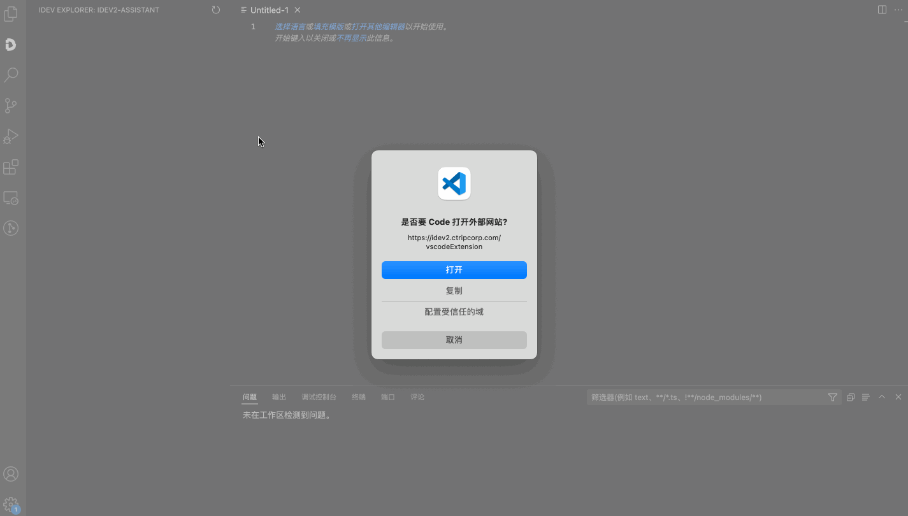
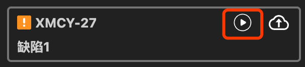
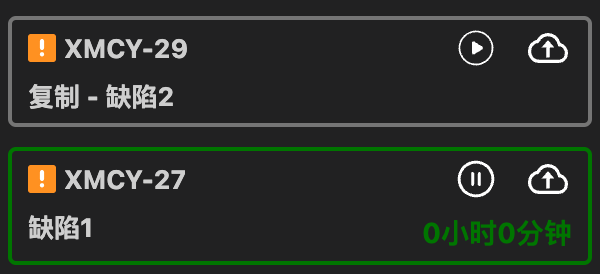
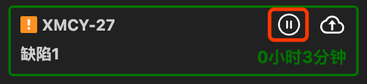
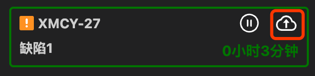

# Idev2 助手

### 登录

初次使用该插件会自动跳转到 idev2 页进行登录，登录完成后即可在侧标 docker 栏查看您的工作台 Issue

### 工时统计

开始统计指定 Issue 工时的方法

1. 点击对应 Issue 上开始按钮
2. 当前活跃分支的名称和任意 Issue Key 能够匹配，自动开始计时

指定工作 Issue 后，对应 Issue 会高亮，同时左下方状态栏会显示工作 Issue 的 Issuekey 以及当前工作状态

结束统计 Issue 工时的方法

1. 点击对应 Issue 上结束按钮
2. 较长时间没有操作 vscode

点击上传键即可上传对应 Issue 工作量至 Idev2

